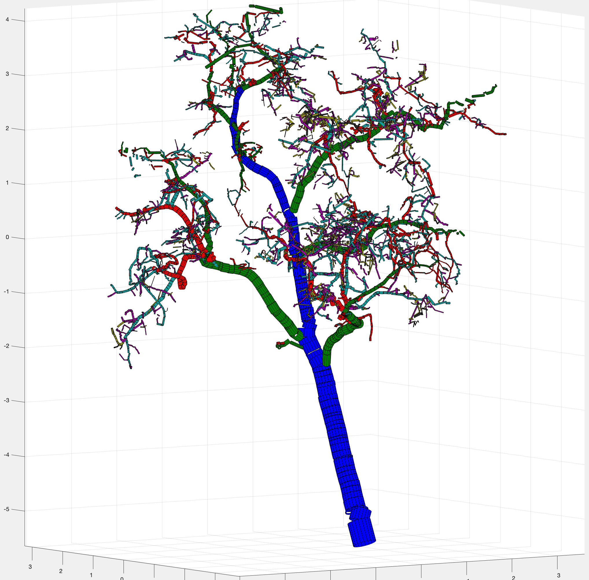

# QSM Processing

Creating QSM Models in completed in two parts; Stripping Leaves and Creating QSM Models

This process produced accurate QSM model of Coastal Red Woods compared to known good AGB measurements. Not yet understood if this process works for other tree species.

Required Programs:

* Matlab
* Python 2 & Python 3
* Anaconda (commandline) [https://docs.anaconda.com/anaconda/install/index.html]()

```
├── Full_Trees
│   └── completed
├── Leaf_Seperator.py
├── QSM_Models
├── README.md
├── Run_QSM.m
├── TreeQSM-master
│   ├── LICENSE.md
│   ├── Manual
│   │   └── TreeQSM_documentation.pdf
│   ├── README.md
│   └── src
│       ├── create_input.m
│   	 ↓ more 
├── Wood_Structure_Trees
│   ├── completed
│   ├── height_1
│   ├── height_2
│   └── height_3
├── bio-env.txt
├── ignore_test.mat
├── img
│   ├── branch.png
│   └── qsm.png
├── package-list.txt
├── temp_qsm_files
│   ├── P.mat
│   └── temp.mat
└── tlseparation


```

## Running Leaf Separator


1. Activate / Setup Conda Environment

	 Activate conda environment using the following command
	 	 
	> conda activate leaf-Envi

	 If your conda environment has not already been initialized use the following command: conda env create --file bio-env.txt
	 	This will only work for osx-64 architecture. If you are using a different operating system use the package-list.txt file to install the packages


	 Setting up the environment to work properly is challenging and tricky
	 	When installing packages try to only use: conda install [package name]
	 	some packages were not available through the conda installer so instead you may need to use pip install [package name] for some packages but try to avoid

	 	tip:
	 	from the command line you can check if the tlseperation module or any other module is installed correctly by launching an inline python shell with the following command: python2.7 
		Then check for the module with this command: import tlseparation
		No errors mean it's properly installed
		
	
2. Run Separation
	
	Place the individual Point Cloud trees in the “Full_Trees” folder and run the leaf seperating program using the following command after the conda enviroment is launched
	
	>python2.7 Leaf_Seperator.py

	Errors could be a result from a package being installed incorrectly. Try the trouble shooting tip in section above. 

	An Error can also occur in the leaf separation process. You can attempt to use a different separation function by uncommenting the following line. make sure to comment out the line above

	> 	wood, leaf = tls.scripts.nopath_generic_tree(arr[:, :3])
			

3. Sort by Height
		Using your own method, sort trees into height categories and place sorted trees into the height_1 - height_3 folders under the Wood_Struture_Trees folder. More height folders can be added as desired. 


## Running QSM Modeling



based on which tree height class your processing. You'll need to adjust the create_input.m file in /TreeQSM-master/src/ AND update the pth variable in the Run_QSM.m file to the correct height folder

	Suggested inputs parameters for create_input.m

		Small - 2 - 10 meters
			inputs.PatchDiam1 = [0.020 .03];
			inputs.PatchDiam2Min = [0.0030 .0060 .0090 .012];
			inputs.PatchDiam2Max = [0.0150 .020 .025];
			inputs.BallRad1 = inputs.PatchDiam1+0.007; 
			inputs.BallRad2 = inputs.PatchDiam2Max+0.003;
			
		Med - 10 - 25 meters
			inputs.PatchDiam1 = [0.045 .08];
			inputs.PatchDiam2Min = [0.0080 .0130 .0180 .023];
			inputs.PatchDiam2Max = [0.010 .0150 .02];
			inputs.BallRad1 = inputs.PatchDiam1+0.02; 
			inputs.BallRad2 = inputs.PatchDiam2Max+0.01;
			
		Biggest 25 - 40+ meters
			inputs.PatchDiam1 = [0.090 .11];
			inputs.PatchDiam2Min = [0.0110 0.0160 0.0210 0.026];
			inputs.PatchDiam2Max = [0.013 .0180 .05];
			inputs.BallRad1 = inputs.PatchDiam1+0.04; 
			inputs.BallRad2 = inputs.PatchDiam2Max+0.02;

	Tip: When processing many trees I suggest launching Matlab on the command line. Seemed to be more reliable.


Once Matlab in loaded and configured run the following command to begin the QSM process.
>run Run_QSM.m
